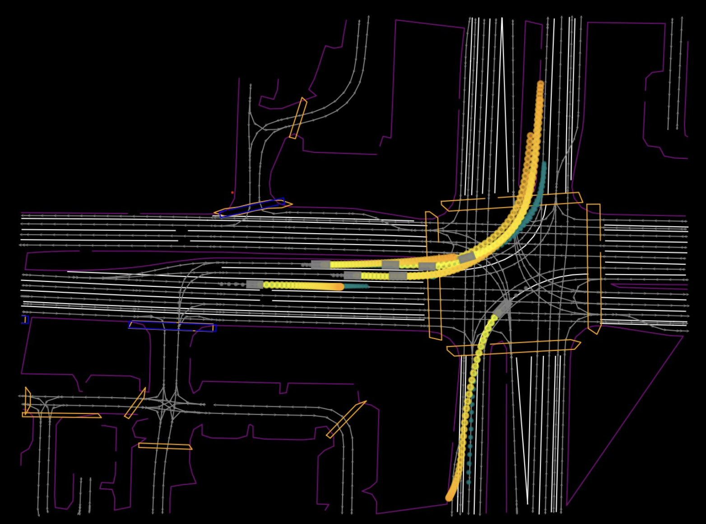

# easy_predict

Exploratory work in trajectory prediction for autonomous driving, using mainly the WOMD (Waymo Open Motion Dataset) dataset.



## Installation [In progress]

We actively try to use the most up to date libraries and tools for educational purposes and to explore the state of the art in python development. Based on this philosophy, we use [uv](https://github.com/astral-sh/uv) as our package manager and [ruff](https://github.com/astral-sh/ruff) as our linter and formatter.

NOTE: This repository has been developed and tested on Linux Ubuntu 22.04.4 LTS.

First make sure you have `uv` installed:

```bash
curl -LsSf https://astral.sh/uv/install.sh | sh
```

Unfortunately the dependencies for waymo open motion dataset can't be resolved with uv, so we need to install the package manually without its dependencies.

```bash
uv pip install waymo-open-dataset-tf-2-12-0==1.6.4 --no-deps
```

## Usage 

For using the data processing utilities and training the model we also use `uv`.

For training the model we first modify the `config/hyperparameters.yaml` file to set the desired batch size, training and validation datasets, etc. and then use the following command to train the model:

```bash
uv run train.py --gpu --fast-dev-run
```
